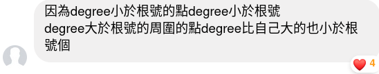

終於搞定了新的 Theme （大概吧），該回來寫題了。

<!-- more -->

## [題目](https://neoj.sprout.tw/problem/252/)

給你一個 $N$ 個點、$M$ 條邊的簡單無向圖（也就是沒有自環或重邊的無向圖），請算出這張圖裡有幾個「三角形」？ \
「三角形」定義為一組數對 $(x,y,z)$ ，使得 $0 \le x<y<z<N$ 且 $(x,y),(y,z),(z,x)$ 均為圖上的邊。

這張圖的點被編號為 $0$ 到 $N−1$ 。\
$3 \le N \le 10 ^ 5, 0 \le M \le 10 ^ 5$

---

### 前情提要

- C++ STL 的 `unordered` 系列很慢，實測也會吃 `TLE` ，思考的時候請暫時忽略他們的存在。`gp_hash_table` 裸裸的用也會 `TLE`。不要去想 Hash 。
  
  <p class="caption"> ZCK 怎麼說就怎麼做。 </p>
- 請好好欣賞複雜度證明（拜託）。也許可以學到一些~~唬爛的技巧~~美麗的作法。

#### Hand Shaking Lemma

$$ 2 \vert E \vert = \sum_{v \in V}{d(v)} $$

白話來說，一張圖 $G = (V, E)$ 中，所有點的點度和等於邊數的兩倍。\
證明應該很直觀，因為一條邊會貢獻兩個點度。

---

## 作法一

嘗試枚舉每一個點 $i \in V$，算包含 $i$ 的三角形有幾個，最後總數 $\div 3$。

應該不難發現有兩種作法：
1. 枚舉鄰邊 $(i, u)$ 和 $(i, v)$，看看對邊 $(u, v)$ 是否存在。複雜度 $O(d(i) ^ 2 \cdot w)$。
2. 枚舉對邊 $(u, v)$，看看鄰邊 $(i, u)$ 和 $(i, v)$ 是否存在。複雜度 $O(M \cdot w)$。

其中，$O(w)$ 代表查詢一個邊 $(i, j)$ 存不存在的複雜度，而本題要求 $w \in O(1)$。\
再仔細觀察一下，作法一對點度少的點好像比較划算。\
如果對點度 $\le K$ 的點用方法一，而點度 $> K$ 則用方法二會發生什麼事呢？

#### 嘗試~~唬爛~~證明複雜度

想出了一個有點唬爛的方法就算算看他的複雜度吧。
1. 點度 $\le K$（以下稱輕點）：
   $$O(\sum_{d(i) \le K}{d(i) ^ 2} \cdot w) = O(K \cdot \sum_{d(i) \le K}{d(i)} \cdot w)$$
   把一個 $d(i)$ 換掉就豁然開朗了呢。再根據 Hand Shaking Lemma：
   $$O(K \cdot \sum_{d(i) \le K}{d(i)} \cdot w) = O(K \cdot M \cdot w)$$
   清楚明瞭。
2. 點度 $> K$（以下稱重點）：\
   首先要注意到重點的數量有限。\
   設其數量為 $C$，則 $C \cdot K < 2M$，即 $C < \frac{2M}{K}$。\
   Hand Shaking Lemma 真好用。\
   做一個點的複雜度就是 $O(M \cdot w)$，一共是 $O(\frac{M ^ 2}{K} \cdot w)$。

總複雜度是 $O(w \cdot (MK + \frac{M ^ 2}{K}))$。有沒有很熟悉？

沒錯！就是根號分塊。取 $K = \sqrt{M}$ 時有最好複雜度 $O(w \cdot M ^ {1.5})$。


#### 那麼 $O(w)$ 呢？$\log$ 又不是常數。

沒錯，這題帶 $\log$ 會 `TLE`。（我寫的應該還算有說服力？)\
那要怎麼讓查詢一個邊變成 $O(1)$ 呢？

1. 這次先看重點。\
   反正都至少 $O(M)$ 了，就乾脆每個點都開一次 `bitset` 紀錄鄰居吧。\
   這樣查鄰邊就 $O(1)$ 了。
2. 那麼輕點呢？好像沒有這麼好算。\
   如果能夠像重點一樣，一次算所有相關一個點的詢問呢？
   不如試試看「紀錄同一個點所有詢問一起算」吧！


#### 離線！

對於所有輕點，把詢問存起來，最後在對所有輕點一個一個做。

每次一樣開一個 `bitset`，然後對於一個點 $i$，
1. 更新所有 $u\ s.t.\ (u, i) \in E$
2. 查詢所有詢問。

這樣查詢就 $O(1)$ 了！
至於用好的複雜度清空 `bitset` 有兩種作法：
1. 用 `vector` 紀錄剛剛改了哪些點，只把這些重設。
2. 改成用 `int` 紀錄，在原本要打 `true` 的地方設成現在處理的點編號。\
   這個小技巧常用在例如 Kosaraju 或二分圖匹配等需要大量重設一個 `bitset` 的時候。

好耶，那就做完了！

### 實作

```cpp
const int N = 100001;

signed main(){
	ios_base::sync_with_stdio(0);cin.tie(0);cout.tie(0);
	int n, m; cin >> n >> m;
	int k = ceil(sqrt(m));

	vector<pii> es;
	vector<int> deg(n, 0);
	vector<vector<int>> adj(n, vector<int>());
	for(int i = 0, u, v; i < m; ++i){
		cin >> u >> v;
		++deg[u], ++deg[v];
		adj[u].pb(v), adj[v].pb(u);
		es.pb(u, v);
	}

	int ans = 0;
	
	// Heavy vertex
	bitset<N> nei;
	for(int i = 0; i < n; ++i){
		if(deg[i] <= k) continue;
		nei.reset();
		for(int v: adj[i]) nei[v] = true;
		for(auto [u, v]: es) ans += (nei[u] and nei[v]);
	}

	// Light vertex
	vector<vector<int>> qs(n, vector<int>());
	for(int i = 0; i < n; ++i){
		if(deg[i] > k) continue;
		for(int j = 0; j < deg[i]; ++j)
			for(int l = 0; l < j; ++l)
				qs[adj[i][j]].pb(adj[i][l]);
	}

	vector<int> la(n, -1);
	for(int i = 0; i < n; ++i){
		for(int v: adj[i]) la[v] = i;
		for(int v: qs[i]) ans += (la[v] == i);
	}

	cout << ans / 3 << '\n';
	return 0;
}
```
[Submission: 3750ms Accepted](https://neoj.sprout.tw/challenge/173033/)\
超乾淨的啦。感謝 `ZCK` 提供作法 :place_of_worship:。

> 也可以對輕點的鄰接串列排序後雙指針爬交集，\
> 重點維持一樣作法，複雜度一樣。\
> 實做在[這裡](https://pastebin.com/AZm4EuX2)。這份比較醜又慢（7840ms）所以就不解釋了。

---

## 作法二

先附上[原出處](https://blog.csdn.net/yang20141109/article/details/50382495)。

不覺得上一個作法每個三角形要算三次很累贅嗎？\
如果我們把邊定向，讓所有邊都從度數較小（如果度數一樣就取編號較小）指向度數大的點，\
這樣就不會重複算了！

也就是，我除了鄰接串列 `vector<vector<int>> adj` 之外，\
我們還要做出另一個東東 `vector<vector<int>> val`（val stands for valid），\
代表一個點的鄰居中度數比他大的人。

接著，我們枚舉（不須依序）每一個點 $i$ 的每一條 val 邊 $(i, u)$，\
看 `val[i]` 和 `val[u]` 有幾個重複的元素，就做完了！


#### 複雜度呢？

看起來好像有點爛？\
試著看每一個點的 `val[i]` 大小，
可以證明他們的大小為 $O(\sqrt{M})$！

<p class="caption"> 我就不解釋了。 </p>

最多有 $O(M)$ 次看兩個 `val[i]` 交集，\
如果先把所有 `val[i]` 排序的話，\
用雙指針爬過去複雜度就是 $O(M \cdot \sqrt M) = O(M ^ {1.5})$！

#### 實作

```cpp
const int N = 100001;

// 給兩個 ordered set 求交集
int inter(vector<int> &a, vector<int> &b){
	int i = 0, j = 0, ans = 0;
	while(i < a.size() and j < b.size()){
		if(a[i] == b[j]) ++i, ++j, ++ans;
		else ++(a[i] < b[j] ? i : j);
	}
	return ans;
}

signed main(){
	ios_base::sync_with_stdio(0);cin.tie(0);cout.tie(0);
	int n, m; cin >> n >> m;

	vector<int> deg(n, 0);
	vector<vector<int>> adj(n, vector<int>());
	vector<vector<int>> val(n, vector<int>());

	for(int i = 0, u, v; i < m; ++i){
		cin >> u >> v;
		++deg[u], ++deg[v];
		adj[u].pb(v), adj[v].pb(u);
	}

	// 建立 val
	for(int i = 0; i < n; ++i){
		for(int j: adj[i]){
			// 也可以用 tie(deg[i], i) < tie(deg[j], j)
			if(deg[i] < deg[j] or (deg[i] == deg[j] and i < j))
				val[i].pb(j);
		}
		sort(AI(val[i]));
	}

	int ans = 0;
	for(int i = 0; i < n; ++i){
		for(int j: val[i])
			ans += inter(val[i], val[j]);
	}
	cout << ans << '\n';
	return 0;
}
```
[Submission: 2540ms Accepted](https://neoj.sprout.tw/challenge/173149/)\
這作法蠻通靈的。不過也許可以給一點啟示？

2022/02/08 Update: 用到類似技巧的酷題：[CodeForces 506D](https://codeforces.com/contest/506/problem/d)

---

## 作法三

在[這裡](https://www.zhihu.com/question/36652212)找到的算法，用到了奇怪矩陣乘法，不實用但酷酷的。\
論文在[這裡](https://www.tau.ac.il/~nogaa/PDFS/ayz97.pdf)，其中 AYZ 的 Z 就是 ZwiCK。無所不在的 ZCK （誤。

---

## 後記

原本聽完這題以後以為自己懂了，但寫題的時候才發現自己什麼都不懂 qwq\
以後看完做法還是盡量去補題吧（還有好多等補）。

喜歡這種~~冗長~~詳細的題解的話麻煩留言讓我知道，\
維持我創作長文的動力 ><\
不然久而久之就會變成寫一兩句話然後丟程式自己看的類型了吧 qwq。
另外，對於新的主題有什麼建議的話一樣可以留言在下面喔。
