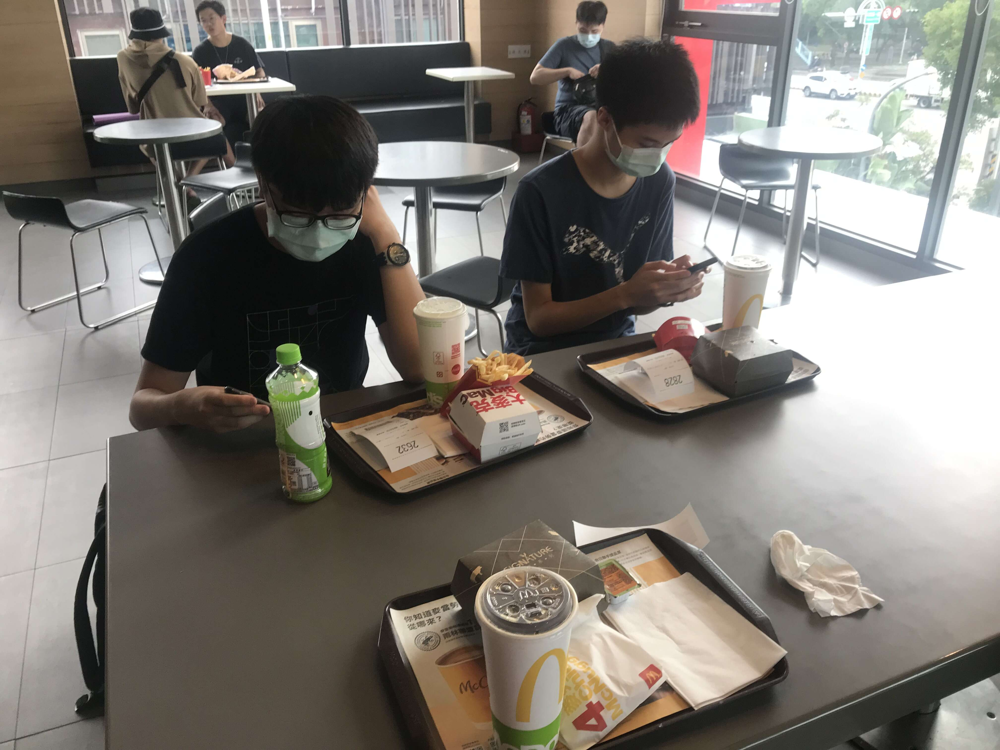

總之，也許是我太弱了（又或許是因為隊友不是兩個女生），感覺有點不值得。

<!--more-->

### 題目

Disclaimer: 憑印象寫的（也許帶有個人主觀內容），可能有誤。

1. 給定一個 $S$ 以及長度為 $n \le 16$ 的序列 $a_i$，求是否可以用 $n$ 個長度分別為 $a_i$ 的小正方形拼出一個邊長為 $S$ 的大正方形。
2. Alice 和 Bob 在玩一個遊戲。兩人分別有一堆大小為 $n_A$ 及 $n_B$ 的硬幣，由硬幣數比較多的人開始拿。每回合可以「拿某一堆的正整數個」或是「兩堆都拿一樣多的正整數個」求誰必勝。特別的，$n_A = n_B$ 時平手。
3. 給一個長度為 $n \le 10^5$ 的序列 $a$，求最大的「非嚴格遞增子序列」的總和。
4. 給定一個簡單多邊形，令第 $i$ 個外角為 $\theta$ ，求 $\sum { \lceil \frac { \theta }{ 55 } \rceil }$。
5. 給定一個由 `p` 和 `d` 構成的矩陣，求從左上角開始右上左下蛇行走，會從 `p` 到 `d` 或反過來幾次。
6. 一開始有一個立方體，定義一次操作為「在所有看的到的面上貼上一顆一樣的立方體」，求 $n \le 190000$ 次操作需要的立方體數。
7. 給定 $n \le 32, k, m$ ，求長度為 $n$、有 $k$ 個 1 的 01 字串中，第 $m$ 大的。
8. 給一個正整數 $n \le 10000$，求三個正整數 $a, b, c$，使得 $a + b + c = n$ 且 $lcm(a, b, c)$ 有最小值。
9. 給定 $n$ 個平面上的點 $(x_i, y_i)$，其中 $0 \le x_i, y_i \le 1000$，求 $i$ 使得第 $i$ 個點到其他所有點的距離和最小。**$n$ 在 `32-bit int` 範圍內。** 
10. 給定一個序列 $a$，其中 $0 \le a_i \le 1000$，以此序列構造一棵二元樹，第 $i$ 個節點的權重為 $a_i$，左右子節點分別為 $2i$ 及 $2i + 1$。求拿掉一條邊、將樹分為兩棵子樹後，兩子樹的權重和的差的最小值。

有沒有發現一些酷酷的地方？

---

### 大概算是題解吧

1. 爆搜加剪枝（B&B）。只有 `balbit` 有做出來，聽說還有點卡。沒什麼問題。
2. 我不會。有一隊用 `return a == b*2;` 之類的判就過了，但那顯然是錯的（考慮 4, 7）。好像跟費氏數列有關係。然後糟糕的是，一開始的範測是對的，比賽一開始就發公告更正成錯的，有人特判範測然後好好做就過了，傻眼。
3. `8e7` 做掉了。大概就是在做 `LIS` 的時候順便紀錄權值。
4. 這題的多邊形有按照邊上的順序排好。官方說考點之一是判斷順時針還是逆時針，作法是直接走一遍判斷轉的角度之類的。雖然大家都這樣做了但沒有人過，疑似是被卡精度（有可能官解用 `float` 實作，選手精度太高被卡）。輸入點座標的格式是 `(x , y) (  x,  y  ) (x,y  )` 之類的怪東西（下面會提供解決辦法）。我還是很好奇官解到底是怎麼實作的。
5. 沒有提供測資大小範圍，反正可以輸入就可以做。實作方法之一是把斜向的、邊上的橫向或直向的分開算，可能要處理一點奇偶性之類的。
6. `8e7` 處理掉了。應該就[這個東東](https://oeis.org/A001845)。
7. 應該不難想到要先 DP 一次然後再從頭一個一個拿。然後這題 `next_permutation` 居然會過，強烈懷疑生測資是用 `rand()` 生的。
8. `JiKuai` 有個強強的 claim 做掉了（好像是枚舉因數當 $a$ 且 $a = lcm(a, b, c)$），`i_am_noob` 似乎用了強強的數學也做掉了。我不會做。
9. 你很好奇 $n$ 到多少嗎？沒關係，大家都好奇。最後試出來只要寫 $O(n^2)$ 就會過了。題目原本沒有給範圍，賽中有人問了兩次，第一次回答在 int 範圍，第二次直接 No comment，題解的時候還說這題這麼簡單為什麼大家都很晚才做。個人認為作為一個正式的國家隊選拔賽，把「猜猜看複雜度是多少才會過」當成一個考點有一點本末倒置了。你以為大家是不會 $O(n^2)$ 作法才不寫嗎？  
   另外，`balbit` 他們好像枚舉跟重心最近的十個點之類的也過了。測資堪憂。
10. 直接在原陣列上算子樹總和就好了。比較討厭的是輸入格式似乎有多餘的空行或是行尾空白，輸入完測資筆數後用 `cin.ignore()` 會 `WA` ，但改成統一用 `getline` 加 `stringstream` 就會過了。可能是有測資是手動輸入導致。

第 4 題滅台，第一、二名都做出 8 題，第三名也有 7 題，意味著想要拿到獎金的話，就必須要做出爆搜或是通靈出特判範測、$n$ 的範圍之類的。

或是找兩個女生組隊拿女力獎也是可以啦。

---

### 心得

本來是抱著對可觀的獎金以及題目進步的期待來打的。雖說我們賽中狀態並不是特別好，但是被題目卡、沒拿到獎金還是覺得有點可惜。只能說對台北人來說，單純為了這場比賽去台中一趟完全不值得。打資讀模競還比較值。

而且今年也沒有 `hhhhaura` 和計程車司機的有趣對話。

附上 `JiKuai`、`8e7` 和 YTP 的點點卡。



----

### 處理毒瘤輸入輸出

以第四題為例，在輸入數字之間用一個 `char` 把括號或逗號讀掉即可。

```cpp
void solve(){
    string s; getline(cin, s);
    stringstream ss(s);
    
    int n; ss >> n;
    vector<int> x(n), y(n);
    for(int i = 0; i < n; ++i){
        char c;
        ss >> c; // (
        ss >> x[i];
        ss >> c; // ,
        ss >> y[i];
        ss >> c; // )
    }
}

int main(){
    // multiple testcases
    int t; cin >> t; cin.ignore();
    for(; t; --t) solve();
    return 0;
}
```

基本上這樣處理就可以應付大部分題目了。個人還是覺得故意讓輸入輸出變麻煩並不是一個好的作法。

想要練習嗎？可以去戳戳看[這題](https://fgiscoj.fg.tp.edu.tw/problem/4479)，滿滿的原汁原味。

另外感謝 `Fysty` 指出錯誤。
