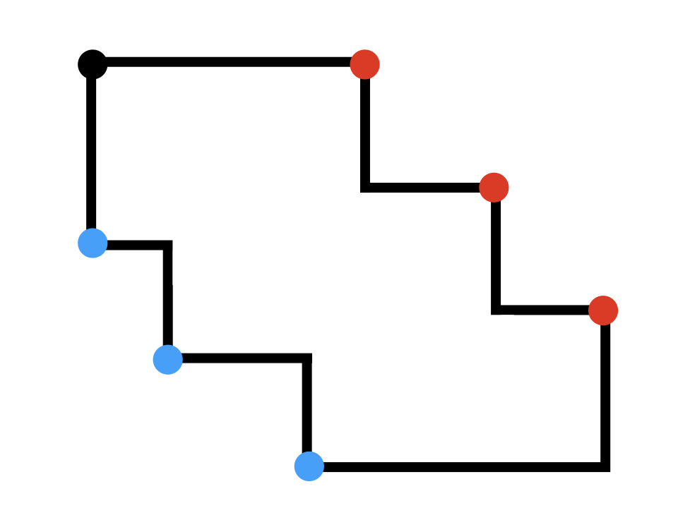
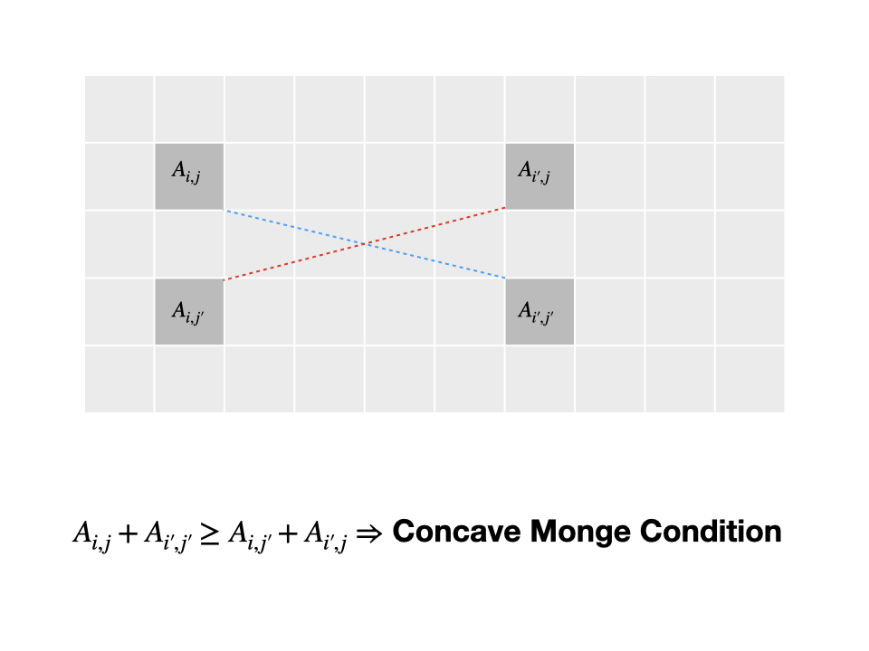
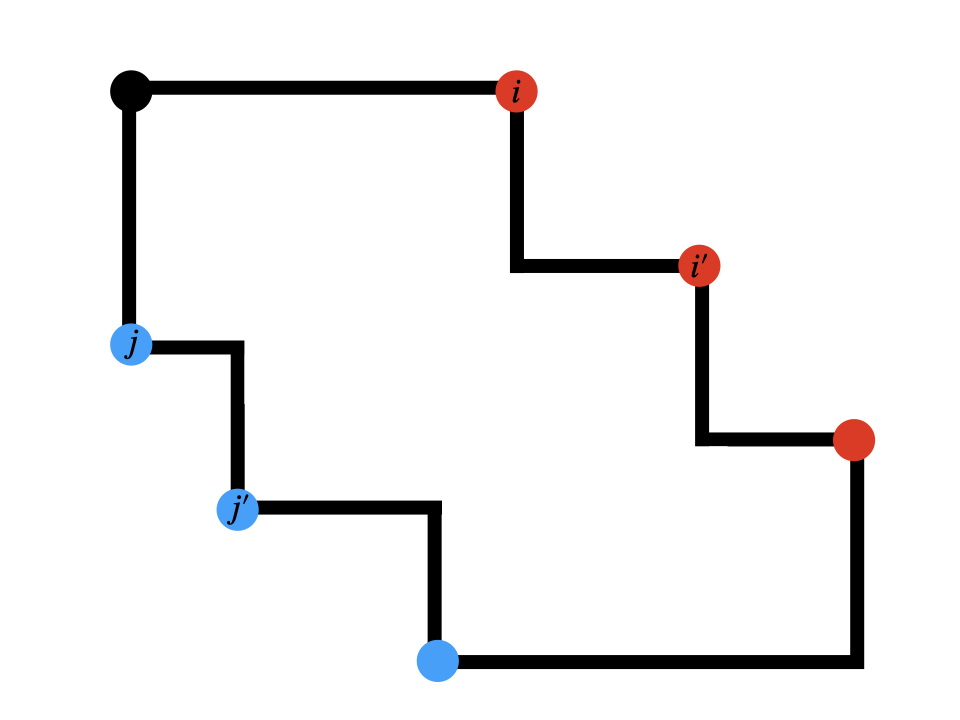
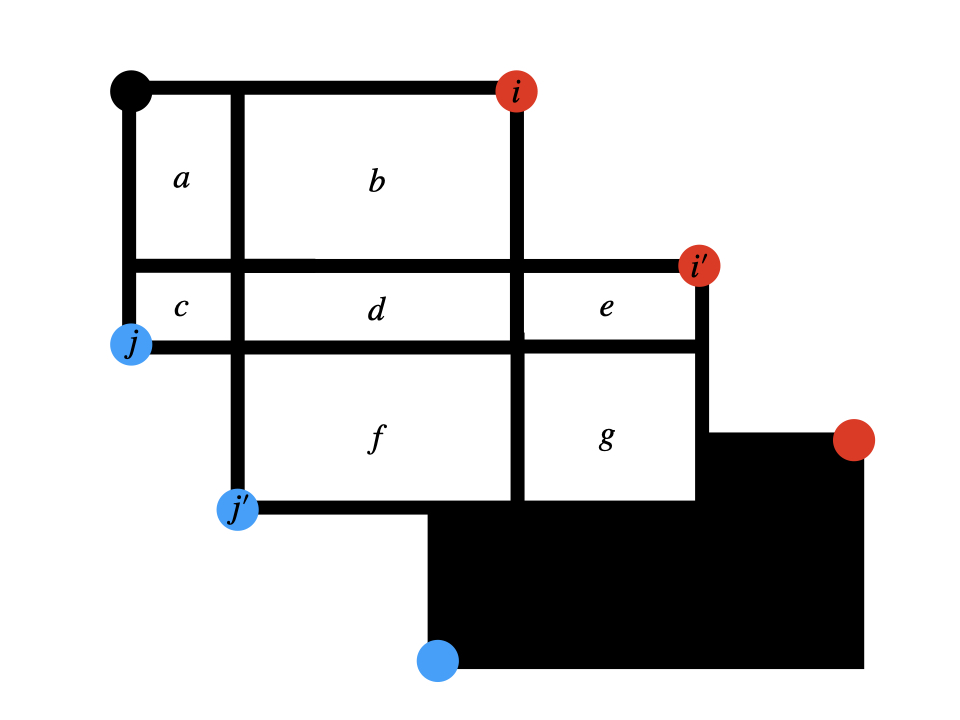

用了 Deque 的四邊形優化做法加了輸入輸出優化就莫名其妙拿下了 Ow0;) 東東抱歉>////<

<!--more-->

> 參考資料：
>
> - [Sean Liu's Post on 2qbx's blog](https://omeletwithoutegg.github.io/2020/01/25/TIOJ-1283/)
> - ToMmyDong 在 IOICamp2021 的講義

重點提示，**請不要帶著 DP 的想法看這篇**，這裡跟 DP 一點關係都沒有。

## [題序](https://tioj.ck.tp.edu.tw/problems/1283)

自己看。

## 思路

我們先把所有右上角的 $n$ 個點叫做紅點，左下的 $m$ 個點叫做藍點，圖就變成這樣了：



注意到有些角根本不重要，所以沒有點點。

我們要想做的事情是，找出每一個可能是答案的「紅點—藍點」點對，逐一計算並取其最大值做為答案。暴力的作法可能長這樣：

```cpp
typedef int64_t ll;
typedef pair<ll, ll> pll;
pll red[N], blu[N]; // 紅點藍點
inline ll area(int r, int b){ // red id, blu id
    // 不小心取到負的也沒關係，反正會被蓋掉。
    // 切記不可以加絕對值，那不是合法的矩形。
    return (red[r].ff - blu[b].ff) * (blu[b].ss - red[r].ss);
}
int32_t main(){
    // eeks & jizzs...
    for(int i = 0; i < n; ++i)
        for(int j = 0; j < m; ++j)
            chmax(ans, area(i, j));
    // jizzs & eeks...
}
```

複雜度是 $O(n^2)$。過不了耶 Ow0;)

## 四邊形優化

還記得我們的目標嗎？「找出每一個可能是答案的『紅點—藍點』點對並逐一計算」，關鍵在於「找出每一個**可能是答案的**點對」。確切要怎麼做呢？

我們先想像有一個表格，橫軸對應到紅點，縱軸對應到藍點，大概會長這樣：

| 點對   | red[1]     | red[2]     | ...  |
| ------ | ---------- | ---------- | ---- |
| blu[1] | area(1, 1) | area(2, 1) | ...  |
| blu[2] | area(1, 2) | area(2, 2) | ...  |
| ...    | ...        | ...        | ...  |

接著，我們會想要略過不算一些不可能是答案的位置。但是，又有哪些位置是不必要的呢？

### 想法一：Monge Condition (`TomMyDong` 的想法)

#### 什麼是 Monge Condition？

先不要管那長得像某海綿的名字，我們來看看他想說什麼？

> 當一個矩陣 $A_{n, m}$ 滿足：
>
> $$ A_{i, j} + A_{i', j'} \geq A_{i, j'} + A_{i', j} \\ \forall 0 \leq i < i' < n, 0 \leq j < j' < m$$
>
> 則他符合 Concave Monge Condition。

看起來很複雜呢！但先別著急，我們把圖畫出來：



就是這樣！移項一下我們可以得到：

$$ A_{i, j} \leq A_{i', j} \Rightarrow A_{i, j'} \leq A_{i', j'}$$

似乎是個漂亮的性質呢。

#### 怎麼用？

讓我們回到我們的假想表格，想辦法把 Monge Condition 翻譯成畫框上的事情。



有沒有好理解一點了？

若能證明他符合 Concave Monge Condition 的話，我們就有一個漂亮的性質可以使用了：

> 如果紅點 $i$ 對到藍點 $j$ 不比紅點 $i'$ 對到藍點 $j$ 好，
> 那接下來的 $j'$ 們都不可能對到 $i$，因為對到 $i'$ 一定不會比較差！

那要怎麼證明 Concave Monge Condition 呢？其實超直觀的！我們先關注上面兩塊（類？）矩形就好：



$$ A_{i, j} + A_{i', j'} \\ = (a + b + c + d) + (d + e + f + g) \\ \geq (b + d + f) + (c + d + e) \\ = A_{i, j'} + A_{i', j} $$

到此就證完了！ $\square$

### 想法二：硬證四邊形（`ZCK` 教的）

待補。

### 實作呢？

我們先照順序枚舉紅點，讓他們每個人防守一個藍點的區間：

- 如果還沒有人防守，那就全部是我的！
- 如果前面有人守了一個區間，但是他在區間的最左邊（最小 $j$ ）就已經比我差了，那他接下來也不可能比我好（上面的漂亮性質），當掉！
- 不然就二分搜我哪裡開始會比他好，搶過來！

然後再枚舉一次藍點，算算他們跟守備他們的人形成的矩形面積，最後取最大值！

扣的待補。我得把他弄的漂亮一點。

### 李超揍他（2021/06/26 補）

既然證出了優超性，符合李超線段樹的使用時機，何不就揍他？

```cpp
struct DOT{
	ll x, y;
	DOT(ll x = 0, ll y = 0): x(x), y(y){}
	ll operator()(const DOT &a){ return 1ll * (a.x - x) * (y - a.y); }
	bool operator<(const DOT &a){ return x < a.x; }
};
vector<DOT> dot;
struct SGT{
	int n; vector<DOT> val;
	SGT(int n): n(n), val(n * 2){}
	constexpr int id(int l, int r) const { return (l + r) | (l != r); }
	void ins(int l, int r, DOT v){ 
		if(l == r){
			if(v(dot[l]) > val[id(l, r)](dot[l])) val[id(l, r)] = v;
			return;
		}
		int m = (l + r) / 2;
		if(v(dot[m]) > val[id(l, r)](dot[m])) swap(val[id(l, r)], v);
		if(v < val[id(l, r)]) ins(l, m, v);
		else ins(m+1, r, v);
	}
	void ins(int x, int y){ ins(0, n-1, DOT(x, y)); }
	ll que(int l, int r, int p){
		debug(l, r, p, val[id(l, r)](dot[p]));
		if(l == r) return val[id(l, r)](dot[p]);
		int m = (l + r) / 2;
		return max(val[id(l, r)](dot[p]), p <= m ? que(l, m, p) : que(m+1, r, p));
	}
	ll que(int p){ return que(0, n-1, p); }
};

signed main(){
	ios_base::sync_with_stdio(0);cin.tie(0);cout.tie(0);
	int n, m;

	{
		cin >> n; n /= 2;
		ll x = 0, y = 0, dx, dy;
		for(int i = 0; i < n; ++i){
			cin >> dx >> dy;
			debug(x + dx, y);
			dot.pb(x + dx, y);
			x += dx, y += dy;
		}
	}
	SGT sgt(n);
	{
		cin >> m; m /= 2;
		ll x = 0, y = 0, dx, dy;
		for(int i = 0; i < m; ++i){
			cin >> dy >> dx;
			debug(x, y + dy);
			sgt.ins(x, y + dy);
			x += dx, y += dy;
		}
	}

	ll ans = 0;
	for(int i = 0; i < n; ++i) chmax(ans, sgt.que(i));
	cout << ans;
	return 0;
} 
```
