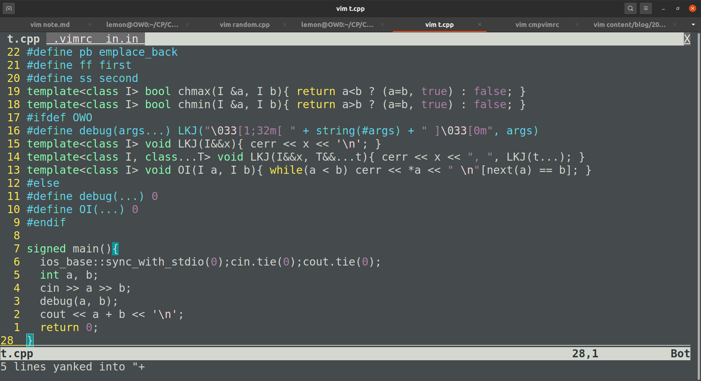

為了明天的 APCS 來複習一下模板，順便放一個備忘錄。

<!--more-->

### vimrc

```vim
sy on
se nu ru rnu cin cul sc so=4 ls=2 bs=2 ts=2 sw=2
inoremap {<CR> {<CR>}<ESC>O
map <F7> :w<CR>:!g++ "%" -o run -DOWO -fsanitize=undefined<CR>
map <F8> :!cat in.in && echo ------------ && ./run < in.in<CR>
```

想知道這些簡寫是啥，可以參考[這裡](https://vimhelp.org/options.txt.html)。
基本的功能都有了，第三、四行字元數還剛剛好的一樣。

用完之後本機長的像這樣：



因為 Ubuntu 本身的 colorscheme 還不錯所以就不調整了。  
（是說如果終端機視窗背景設定是半透明的，截圖的 .png 檔也會是半透明的，超酷）

### C++ template

```cpp
// Knapsack DP is harder than FFT.
#include<bits/stdc++.h>
using namespace std;
typedef long long ll; typedef pair<int, int> pii;
#define AI(x) begin(x),end(x)
#define pb emplace_back
#define ff first
#define ss second
template<class I> bool chmax(I &a, I b){ return a<b ? (a=b, true) : false; }
template<class I> bool chmin(I &a, I b){ return a>b ? (a=b, true) : false; }
#ifdef OWO
#define debug(args...) LKJ("\033[1;32m[ " + string(#args) + " ]\033[0m", args)
template<class I> void LKJ(I&&x){ cerr << x << '\n'; }
template<class I, class...T> void LKJ(I&&x, T&&...t){ cerr << x << ", ", LKJ(t...); }
template<class I> void OI(I a, I b){ while(a < b) cerr << *a << " \n"[next(a) == b], ++a; }
#else
#define debug(...) 0
#define OI(...) 0
#endif

signed main(){
	ios_base::sync_with_stdio(0);cin.tie(0);cout.tie(0);
	int a, b;
	cin >> a >> b;
	debug(a, b);
	cout << a + b << '\n';
	return 0;
}
```

主要就 `#define` 一些常用的關鍵字，debug 函式（有顏色喔！），還有 `ZCK` 最愛的 `chmin & chmax`。
那個 `ch` 就是唸作「取」沒錯喔 XD

### 一些給自己的注意事項

- 早睡早起，健康破台
- 記得生測資檢查，**APCS 是後測**，WA 總比 FST 好。
- 不要急，有兩個半小時慢慢寫。
- 像生測資一樣檢查所有 Corner Case。
- 記得 DP 是個好用的工具。
- GLHF
