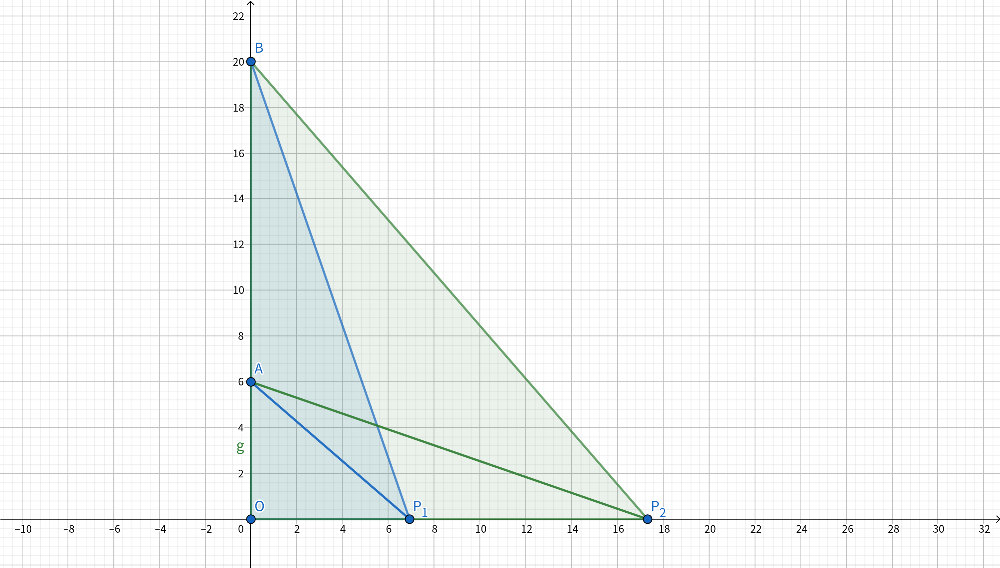
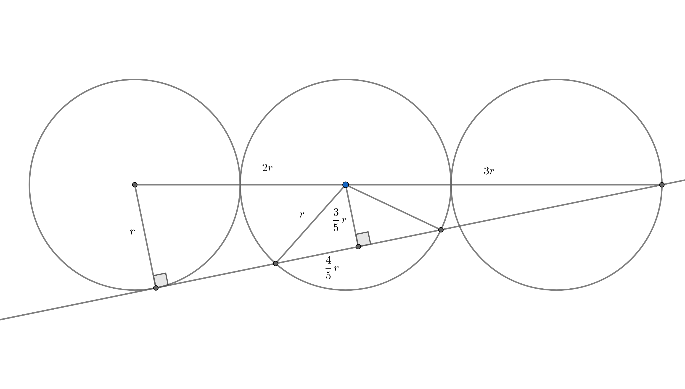
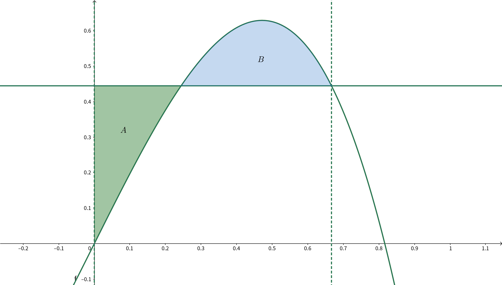

感謝同學們把題目背出來。

<!--more-->

## 題目

考試時間：$13:30 \sim 15:10$ 共 $100$ 分鐘。
試卷共 $16$ 題，前 $12$ 題 $6$ 分，後 $4$ 題 $7$ 分。

### 1

投一枚公正的硬幣，當累計擲出正面與背面的次數相差為 $3$ 時結束。
若已知一次試驗是以正面次數多於背面次數三次結束，則第一次是背面的機率為何?

### 2

一矩形區域如下圖，各邊長如圖所示，今從左上角走到右下角，但灰色區域只能水平或鉛直走（如下圖虛線），已知最短路徑長度為 $a + b \sqrt{c}$ ，其中 $\sqrt{c}$ 為最簡根式，求 $(a, b, c) = ?$

### 3

有一數列 $S = 1, 2, 2, 3, 3, 3, 4, 4, 4, 4, ...$，求第 $2022$ 項為何？

### 4
在座標空間中，有 $A(0, 0, 6)$ 、 $B(0, 0, 20)$ ，且點 $P(x, y, 0)$ 符合 $0 \le x, y \le 15, \angle APB \ge 30 ^ \circ$，已知 $P$ 的軌跡形成之面積為 $a + b \sqrt{c}$，其中 $\sqrt{c}$ 為最簡根式，求 $(a,b,c)$。

### 5

令 $S_n$ 為一等比數列前 $n$ 項之和，且 $S_8 = 10 S_4$ ，求此等比數列之公比。（共有三解，皆需列出）

### 6

$f(x, y) = x^2y + 4x^2 + xy + 11x + 1$
$h(x, y) = 2x^5y + 10x^5 - x^4y - 5x^4 + 9x^3 + 2x^2y + 15x^2 + xy + 17x + 2$
已知 $k$ 是整數常數，$h(x, k) = q(x) f(x, k)$ 且 $q(x)$ 為 $x$ 的整係數多項式，求 $k$ 之值。

### 7

一隨機變數輸出為 $0 \sim 10$，求變異數最大值。

### 8

$0 \le t \le \pi$，平面上有一點 $P(2 \cos (t - \frac{\pi}{6}), \cos (t + \frac{\pi}{3}))$。已知 $P$ 點到原點的距離最大值為 $M$ ，最小值為 $m$，求 $(M, m) = ?$

### 9

有一平面包含直線 $2x-8 = -2y+4 = z-4$ ，且此平面與 $(x-2)^2 + (y-2)^2 + (z-2)^2 = 2$ 相切，求此平面。

### 10

六個半徑為 $r$ 的圓，圓心共線，相切如下圖。直線 $\overline{AB}$ 為第一個圓及第六個圓的內公切線，交第五個圓於 $C$、$D$ 兩點。求 $\overline{CD}$。

### 11

$f(x, y, z) = x^2 + (y-2)^2 + (z+4)^2 + |x| + |y| + |z|$ ，求最小值發生在 $(x, y, z) = ?$

### 12

在座標平面上，當 $a, b$ 為整數時，定義 $P\{(x,y)| x=a, b \le y\le b+1\}$ 與 $P\{(x,y)|a \le x \le a+1, y=b\}$ 為格線，$P\{(x,y)|a \le x \le a+1, b \le y \le b+1\}$ 為格子，今有一以原點為圓心，直徑為 $2n-1$ 的圓，與 $h$ 條格線相交，與 $k$ 個格子相交，求 $(h, k) = ?$

### 13

從 $1$ 到 $30$（含 $1$ 及 $30$） 挑三個相異正整數。求有多少種組合使得三數和是 $30$ 的倍數。

### 14

在數線上行走，每次移動時有 $\frac{1}{3}$ 的機率往左走 $1$ 單位，$\frac{2}{3}$ 的機率往右走 $1$ 單位，走到 $0$ 或 $N$ 時結束，定義 $P_N(x)$ 為從 $x$ 開始行走時，最終走到 $N$ 的機率，定義 $P_N(0)=0$ ，$P_N(N)=1$ ，試求 $lim_{N\to \infty}P_N(2)$ 之值。

### 15

$f(x) = 2x-3x^3$ ，$c$為正實數，$y$ = $f(x)$與 $y = c$ 所圍面積為 $A$ ， 
$y = f(x)$ , $y = c$ , $x = 0$ 三者所圍面積為 $B$，當 $A = B$ 時， $c = ?$

> 這題好像有點問題

### 16

$n$ 為整數，請問有多少個 $n$ 使得 $n^3-7n+9$ 為質數？

---

以下為解答，墊個防雷可愛仙人掌。

---

## 解答

我們自己算的，不保證是正解。

1. $\frac{1}{3}$
2. $(5, 3, 5)$
3. $64$
4. $(13 \pi, 75, 3)$
5. $-1, \pm \sqrt 3$
6. $-6$
7. $25$
8. $(2, 1)$
9. $x+y=6$
10. $\frac{8}{5}r$
11. $(0, \frac{3}{2}, \frac{-7}{2})$
12. $(8n-4, 8n-4)$
13. $136$
14. $\frac{3}{4}$
15. 題意不清
16. $3$

---

## 詳解

### 1

令 $P(n)$ 為 $($ 正面次數 $-$ 反面次數 $) = n$ 時，最後在正面比反面多三次結束的機率。答案為 $\frac{\frac{1}{2} P(-1)}{P(0)}$ 。

顯然 $P(-3) = 0, P(3) = 1$ ，而 $|n| > 3$ 不需要考慮。可以列出遞迴式

$$P(x) = \frac{1}{2} P(x-1) + \frac{1}{2} P(x + 1)$$

此後有兩種觀點：

1. 在數線上做一些點 $p_k = P(k)$ ，遞迴式可看做取線段等分點，故 $P(-3) \sim P(3)$ 是在線段 $[0, 1]$ 上的一些等分點，故知 $P(k) = \frac{k - (-3)}{6}$。
2. 整理得 $P(x) - P(x-1) = P(x + 1) - P(x)$ 令 $ = d$ ，加總得 $6d = 1, d = \frac{1}{6}, P(k) = P(-3) + (k+3) d = \frac{k+3}{6}$

故答案為 $\frac{1}{3}$ 。

### 2

可以知道在灰色區域走越多越虧，而且至少要走 $5$ ，接著忽略灰色區域得到一個 $3 \times 6$ 的矩形，知走對角線最短距離為 $3 \sqrt 5$ ，故答案為 $5 + 3 \sqrt 5$ 。我不會證。

### 3

求 $x$ 使得 $(x-1) x < 2022 \le x (x + 1)$ ，得 $x = 64$。

### 4

設 $\overline {OP} = x$ ，可得：

$$
\begin{aligned}
& \cos \angle APB
= \frac{\overline {AP} ^ 2 + \overline {BP} ^ 2 - \overline {AB} ^ 2}{2 \cdot \overline {AP} \cdot \overline {BP}} \\\
= & \frac{(x^2 + 36) + (x^2 + 400) - 196}{2 \sqrt{(x^2 + 36)(x^2 + 400)}} \le \frac{\sqrt 3}{2} \\\
\Rightarrow & (2x^2 + 240) ^ 2 = 3x^4 + 1308x^2 + 400 \cdot 108\\\
\Rightarrow & x^4 - 348x^2 + 14400 = 0 \\\
\Rightarrow & (x^2 - 48)(x^2 - 300) = 0 \\\
\Rightarrow & x = 4 \sqrt 3 \cup 10 \sqrt 3
\end{aligned}
$$

以半徑為 $4 \sqrt 3$ 及 $10 \sqrt 3$ 在 $15 \times 15$ 的方形上畫扇型取面積，會發現某個角度成 $30 ^ \circ$ ，最後算出來是 $225 - 12 \pi - (225 - 75 \ sqrt 3 - 25 \pi) = 13 \pi + 75 \sqrt 3$ 。

### 5

先驗公比為 $1$ 時不成立，得

$$
\begin{aligned}
& \frac{a(1 - r ^ 8)}{1 - r} = 10 \frac{a(1 - r ^ 4)}{1 - r} \\\
\Rightarrow & r ^ 8 - 10 r ^ 4 + 9 = 0 \\\
\Rightarrow & (r ^ 4 - 9)(r ^ 4 - 1) = 0 \\\
\Rightarrow & r = \pm \sqrt(3), \pm 1
\end{aligned}
$$

記得把 $1$ 去掉。這題的問題在題目沒有說公比可不可以是複數，如果可以的話會再多 $\pm \sqrt 3 i, \pm i$ 四組解。

### 6

1. 先集項，看首項係數要有因倍數關係。特別注意 $k = 4$ 時不是答案。
$$
\begin{aligned}
f(x, k) = & (4 + k) x^2 + (11 + k) x + 1 \\\
h(x, k) = & (10 + 2k) x^5 + (-5 - k) x^4 + 9x^3 + (15 + 2k) x^2 + (17 + k) x + 2 \\\
\Rightarrow & \frac{10 + 2k}{4 + k} \in \mathbb{Z} \\\
\Rightarrow & \frac{2}{4 + k} \in \mathbb{Z} \\\
\Rightarrow & k = -2, -3, -5, -6
\end{aligned}
$$

2. $h(1, k)$ 是 $f(1, k)$ 的倍數。
$$
\begin{aligned}
f(1, k) = & 16 + 2k \\\
h(1, k) = & 48 + 4k \\\
\Rightarrow & \frac{48 + 4k}{16 + 2k} \in \mathbb{Z} \\\
\Rightarrow & \frac{8}{8 + k} \in \mathbb{Z} \\\
\Rightarrow & k = -4, -6, -7, \cdots
\end{aligned}
$$

3. 取聯集，$k = -6$ 。

### 7

$0, 10$ 各有一半的機率被輸出，變異數 = $25$。

變異數的定義請參照 [這裡](https://zh.wikipedia.org/zh-tw/%E6%96%B9%E5%B7%AE) 。

### 8

換成 $\frac{- \pi}{6} \le t \le \frac{5 \pi}{6}, P(2 \cos t, sin(t))$ 。距離展開之後就很單純只是找極值而已。

### 9

梗是那條線切那顆球，求出切點後就知道平面法向量，帶回去就知道平面方程式了。

### 10

### 11

$x, y, z$ 分開算，討論兩個狀況。 $x$ 顯然是 $0$ ， $y, z$ 就展開代 $\frac{-b}{2a}$ 。

### 12

可以證明此圓不會通過格子點，令圓上一點 $P(x, y), -n < x, y < n$ 。假設從左端出發經上半圓至右端，過程中必經過 $x = 1-n \sim x = n-1$ 共 $2n - 1$ 條垂直的格線，上下左右半圓加總共 $8n - 4$ 。而每經過一條格線就會進入一個新的格子，故格子數也是 $8n - 4$ 。

感謝超強的 `8e7` 支援這題解答。

### 13

令答案 $a, b, c, 1 \le a < b < c \le 30$

| $a$      | $\min b$         | $\max b$         | $\\#$     |
| -------- | ---------------- | ---------------- | -------- |
| $1$      | $b = 2, c = 27$  | $b = 14, c = 15$ | $13$     |
| $2$      | $b = 3, c = 25$  | $b = 13, c = 15$ | $11$     |
| $3$      | $b = 4, c = 23$  | $b = 13, c = 14$ | $10$     |
| $\vdots$ | $\vdots$         | $\vdots$         | $\vdots$ |
| $9$      | $b = 10, c = 11$ | $b = 10, c = 11$ | $1$      |

規律：$n, n-2, (n-2) - 1, \cdots \Rightarrow 13 + 11 + 10 + 8 + 7 + 5 + 4 + 2 + 1 = 61$

| $a$      | $\min b$         | $\max b$         | $\\#$     |
| -------- | ---------------- | ---------------- | -------- |
| $1$      | $b = 29, c = 30$ | $b = 29, c = 30$ | $1$      |
| $2$      | $b = 28, c = 30$ | $b = 28, c = 30$ | $1$      |
| $3$      | $b = 27, c = 30$ | $b = 28, c = 29$ | $2$      |
| $\vdots$ | $\vdots$         | $\vdots$         | $\vdots$ |
| $14$     | $b = 16, c = 30$ | $b = 22, c = 24$ | $7$      |

規律：$1, 1, 2, 2, 3, 3, \cdots \Rightarrow (1 + 7) \cdot 7 = 56$

| $a$      | $\min b$         | $\max b$         | $\\#$     |
| -------- | ---------------- | ---------------- | -------- |
| $15$     | $b = 16, c = 29$ | $b = 22, c = 23$ | $7$      |
| $16$     | $b = 17, c = 27$ | $b = 21, c = 23$ | $5$      |
| $\vdots$ | $\vdots$         | $\vdots$         | $\vdots$ |
| $19$     | $b = 20, c = 21$ | $b = 20, c = 21$ | $1$      |

規律：$n, n-2, (n-2) - 1, \cdots \Rightarrow 7 + 5 + 4 + 2 + 1 = 19$

$61 + 56 + 19 = 136$

### 14

和第一題差不多的技巧。

$$
\begin{aligned}
& P(x) = \frac{1}{3} P(x - 1) + \frac{2}{3} P(x + 1) \\\
\Rightarrow & P(x) - P(x - 1) = 2 ( P(x + 1) - P(x) ) \\\
\Rightarrow & P(1) - P(0) = d, P(k) - P(k - 1) = d \cdot 2 ^ {1 - k} \\\
\Rightarrow & \lim _ {N \rightarrow \infty} \sum _ {k = 1} ^ {N} d \cdot 2 ^ {1 - k} = 1 \\\
\Rightarrow & d = \frac{1}{2}, P(2) = \frac{1}{2} + \frac{1}{4} = \frac{3}{4}
\end{aligned}
$$

### 15

問題在圍成面積不只有第一象限的，但那就會變成求極值，不懂這樣考意義在哪。下面提供只求第一象限的作法。

令較右邊的交點為 $(k, c)$。

$$
\begin{cases}
2k - 3k^3 = c \\\
\int _ {0} ^ {k} (2x - 3x^3 - c) dx = 0
\end{cases}
\Rightarrow k^2 - \frac{3}{4} k^4 - ck = 0
$$

把第一式代入第二式的 $c$ ：

$$
\begin{aligned}
& k^2 - \frac{3}{4} k^4 - (2k - 3k^3) k = 0\\\
\Rightarrow & \frac{9}{4}k^4 - k^2 = 0\\\
\Rightarrow & k^2 (3k + 2) (3k - 2) = 0\\\
\Rightarrow & k = \frac{2}{3}, c = \frac{4}{9}
\end{aligned}
$$

### 16

令 $f(n) = n^3 - 7n + 9, f(n + 1) - f(n) = 3n^2 + 3n - 6, f(0) = 9$ ，故 $f(n)$ 皆為 $3$ 的倍數，所以只要求 $f(n) = 3$ 有幾組解。答案是 $-3, 1, 2$ 三組。

---

如果上面有錯請留言告知 ><
